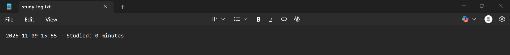

# Study Countdown Timer (CLI)

A focused command-line study timer that helps build consistency and discipline.  
You choose how many minutes to study, and the timer runs.  
Supports pause, resume, stop anytime, and automatically keeps a log of all study sessions.

---

## Features

- ⏱️ Countdown timer (not a stopwatch)
- ✋ Pause and resume anytime
- 🛑 Stop early if needed — still counts your time
- 📝 Automatically logs all study sessions to `study_log.txt`
- 🎯 Minimal controls for focus (no distractions)

---

## Controls

| Key | Action |
|-----|--------|
| `p` | Pause |
| `r` | Resume |
| `s` | Stop early and save log |

---

## How to Run

Enter the number of minutes to study, then focus.

---

## Log File Example (study_log.txt)

=== Study Log ===

2025-11-09 16:12 - Studied: 25 minutes  
2025-11-09 18:44 - Studied: 14 minutes
---

## Example Output

---

